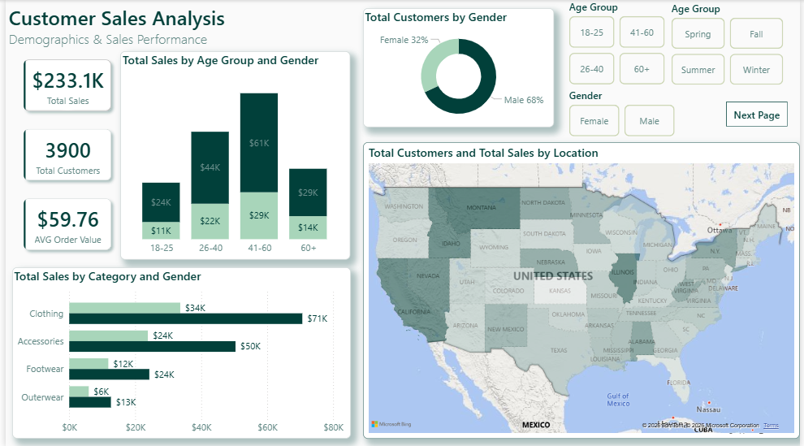
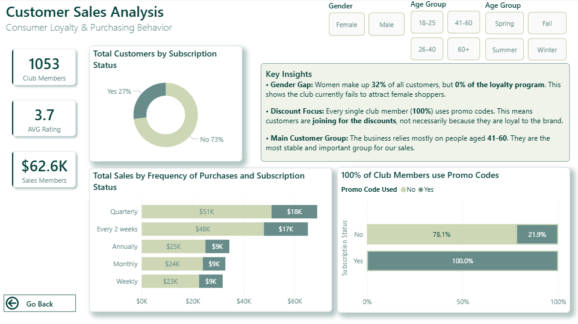

# Customer Shopping Behavior Analysis
## 📌 Project Overview
The goal of this project was to conduct a **comprehensive end-to-end analysis** of customer behavior using a retail dataset sourced from Kaggle. I focused on transforming raw data into a structured, interactive dashboard that identifies high-value customer segments and evaluates the effectiveness of loyalty programs.

## 📺 Dashboard Demo

https://github.com/user-attachments/assets/a1962e3f-a145-47ce-9baa-0547f20f6691

### 📊 Page 1: Demographics & Sales Performance


This view identifies **who** the customers are and **where** the revenue comes from:
* **Revenue Drivers:** Analysis of Sales by Age Group and Gender to pinpoint the most profitable segments.
* **Category Deep-Dive:** Sales by Category with a **Tooltip** revealing the **Top 5 Products** for instant detail.
* **Geographical Insights:** A map visualization linking Total Customers and Sales to specific locations.

### 📊 Page 2: Consumer Loyalty & Purchasing Behavior


This section focuses on **how** customers shop and what motivates their loyalty to the brand:
* **Subscription Status:** A breakdown of Total Customers by subscription type to measure loyalty program penetration.
* **Engagement Analysis:** Correlation between **Purchase Frequency and Subscription Status** to compare member vs. non-member behavior.
* **Promotion Impact:** A significant finding showing that **100% of loyalty members use promo codes**, highlighting the primary driver for club retention.
* **Strategic Takeaways:** A dedicated **Key Insights** section that translates data patterns into clear business conclusions.
  
## 🛠️ Tech Stack & Tools
* **Power BI Desktop** – Data visualization and report building.
* **Power Query** – Data cleaning and transformation.
* **DAX (Data Analysis Expressions)** – Created calculated measures.
* **GitHub** – Documentation and project hosting.

## 💡 Key Insights
Based on the analysis, three strategic areas were identified:
* **Gender Gap:** Women make up 32% of all customers, but **0% of the loyalty program**. This suggests the current club benefits or marketing fail to attract female shoppers.
* **Discount Focus:** **100% of club members use promo codes**. This indicates that membership is driven purely by price sensitivity rather than brand emotional loyalty.
* **Main Customer Group:** The business relies heavily on the **41-60 age segment**, which serves as the most stable and significant revenue driver.

### 📊 Key DAX Measures
Below are the core measures created to drive the analysis and provide business insights:

| Measure Name | Description |
| :--- | :--- |
| **Total Sales** | Calculates the total revenue across all transactions. |
| **Total Customers** | Counts unique Customer IDs to determine the size of the customer base. |
| **Total Orders** | Measures the total volume of transactions. |
| **AVG Order Value** | Calculates the average spend per transaction. |
| **Club Members Count** | Identifies the number of customers enrolled in the loyalty program. |
| **Sales Members** | Isolates revenue generated specifically by loyalty program participants. |
| **Sales Deviation** | Calculates the difference between local sales and the national average to highlight geographical performance gaps. |

<details>
<summary><b>🔍 View DAX Code: Sales Deviation (Visual Optimization)</b></summary>

  ```dax
Sales Deviation = 
VAR TotalSalesAllStates = 
    CALCULATE(
        [Total Sales], 
        ALLSELECTED('shopping_behavior_cleaned')
    )

VAR NumberOfStates = 
    CALCULATE(
        DISTINCTCOUNT('shopping_behavior_cleaned'[Location]), 
        ALLSELECTED('shopping_behavior_cleaned')
    )

VAR AverageSales = TotalSalesAllStates / NumberOfStates

RETURN 
[Total Sales] - AverageSales
```

Why this measure?

The raw sales data across different states was very similar, which caused the map visualization to lack color contrast. I developed this measure to calculate the deviation from the national average. This approach "stretched" the data range, making geographical differences instantly visible and much easier for the user to interpret.
</details>


## 🚀 Project Navigation & Viewing
Below you can find the files included in this repository and how to access them:

* [Customer_Shopping_Behavior_Report.pdf](Customer_Shopping_Behavior_Report.pdf) – **Quick Preview.** Click to see the full layout and design without needing Power BI.
* [Customer_Shopping_Behavior_Analysis.pbix](Customer_Shopping_Behavior_Analysis.pbix) – **Interactive Model.** Download and open in Power BI Desktop to explore all DAX measures, data relationships, and filters.
* [/images](/images) – **Highlights.** A folder containing high-resolution screenshots of interactive tooltips and specific dashboard views.

## 📌 Author
**Adrianna Bronowicka**  
Power BI & Data Analytics Portfolio Project
